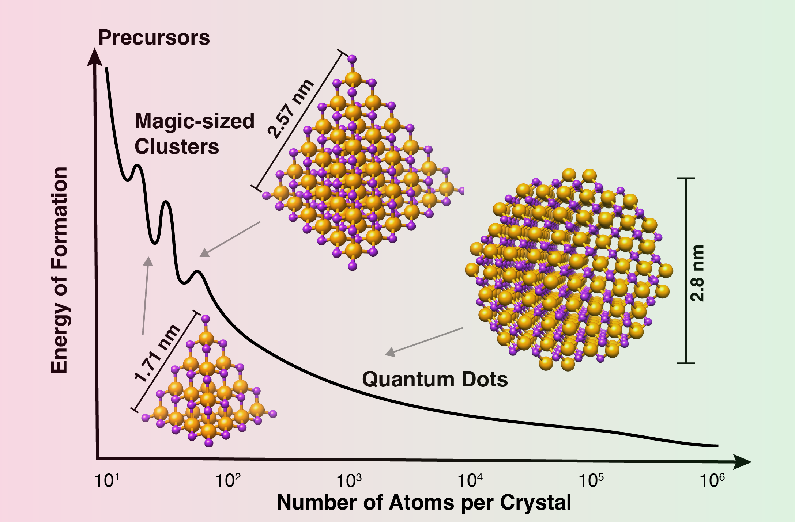

# CdSe-NMR-DFT

This repository scripts for running the analysis described in the paper ["Atomic-Level Insights into the Nanocluster to Quantum Dot Transition of CdSe from DNP-NMR "](url-to-be-added).

<p align="center">
  
</p>

## Paper analysis scripts
1. code for analyzing NMR spectra
2. code for analyzing DFT calculation results
3. code for running hydrogen-bond Monte Carlo calculation

## Using scripts
1. Clone this repository
```
git clone https://github.com/Xyunyao/CdSe_nmr_DFT.git
```
2. Install  Required Dependencies
```
conda env create -n Cd_Se_analysis
conda activate Cd_Se_analysis
conda install 
```
3. Download and unzip the raw data from [here](10.6084/m9.figshare.27297354)

4. run scripts using jupyter notebook for .pynb file and python *.py for .py file


